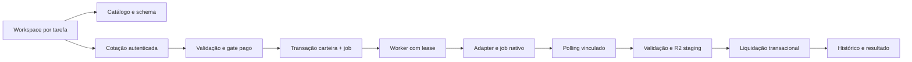

# Arquitetura Generation 2.0

## Anterior e evolução

A estrutura Provider → Model → Version → Preset → Job é útil e foi preservada conceitualmente. O código anterior resolve preset/defaults, verifica apenas campos required do schema, aplica mapeamento genérico de quality para steps/guidance e debita antes de inserir/disparar. Jobs e adapters de imagem/vídeo são separados. Essas peças ficam em COMPATIBILITY.

V2 materializa uma oferta versionada com provider/modelo nativo, capabilities, fields tipados, inputs por papel, regras combinatórias e pricing. GenerationModel é o agregado resolvido do catálogo, não uma nova cópia de todas as cinco collections antigas. Defaults fazem o papel do preset inicial. Presets nomeados e schema JSON completo podem ser adicionados depois; não há editor de presets v2 nesta fase.

## Contrato HTTP

GET /api/generation/catalog é público; POST quote, POST jobs, GET jobs, GET jobs/{id}, POST cancel e GET download exigem autenticação. Jobs usam Idempotency-Key com 16–100 caracteres. Ownership vem do subject do JWT; nenhum userId econômico é aceito do cliente. Resposta usa o formato de erro já existente do projeto.

JobView expõe prompt somente ao dono, status/creditState e controles. Não expõe API key, referência original, token de polling ou URL assinada. O histórico traz as últimas 30 entradas; paginação completa e biblioteca de assets são próximos incrementos.

## Estados e garantias

Queued → Starting → Processing → Completed/Failed. Cancelled somente antes da submissão. Reserva e criação compartilham transação de replica set. Índice único (UserId, IdempotencyKey) protege concorrência. Claim adquire lease de 5min; tentativa limita 2min. Processing com lease expirado pode retomar polling. Starting sem binding após crash só é reclamado no deadline e estornado como submission_unknown; nunca há nova submissão automática.

Deadline: imagens 10min, vídeo 20min. Polling normal 5s; erros têm backoff até 120s. O worker verifica disponibilidade atual antes do POST. Download/PUT temporariamente falho permite reconsultar o mesmo job, sem repetir geração. Liquidação exige Reserved e lease/status correspondente; falha/cancelamento incrementa carteira uma única vez. As garantias dependem de transações Mongo operacionais: testes unitários não provam concorrência do Atlas, ainda pendente do deploy.

GenerationLifecycle mantém o calendário de retirada confirmado dos Veo Preview. Ofertas com retirada próxima ou lifecycle COMPATIBILITY retornam migration_required, impedindo reserva e POST mesmo após habilitar gasto. Na data de retirada, retornam retired e recusam cotação; o catálogo inteiro continua respondendo. Isso protege também snapshots/catalog rows antigos marcados ACTIVE. Uma migração de fornecedor/endpoint exige um adapter e uma versão reais; trocar só o nome do modelo seria incorreto.

V2 não publica webhook de provider. Usa polling para evitar adicionar três superfícies de callback antes da homologação. Callbacks duplicados não têm rota v2 onde possam liquidar créditos; polling duplicado fica limitado por lease e liquidação. Os webhooks antigos permanecem com seus testes existentes. Um adapter fal futuro precisa assinatura ED25519/JWKS, timestamp, body bruto e deduplicação vinculada ao providerJobId. Não reutilizar cegamente autenticação de outro vendor.

## Storage e privacidade

Chaves determinísticas generation-v2/{owner}/{job}.{ext}. Imagens ficam no bucket público staging já existente; vídeo no bucket privado e sai por download autenticado. Não afirmar privacidade de imagens só porque o endpoint de download exige dono: a URL pública R2 pode ser compartilhada. Uma galeria privada de imagens exige outra decisão de storage antes do lançamento.

Saída exige assinatura PNG/JPEG/WebP ou MP4 e limite 20MiB imagem/100MiB vídeo. A validação de referência verifica encoding, assinatura e IHDR/dimensões, sem decoder PNG completo; arquivos malformados além do header podem ser rejeitados pelo provider. SSRF usa hosts HTTPS permitidos, DNS público fixado e redirects recusados. Chave Google só acompanha downloads no host oficial da API, nunca storage.googleapis.com. Signed URLs nativas não são servidas ao browser.

Inputs ficam em Mongo enquanto o job está aberto e são removidos na liquidação. Prompts e controles persistem no histórico do dono; falta política formal de retenção. Gemini store=true implica retenção adicional no fornecedor; não chamar esse caminho de zero-retention. Crash depois do PUT e antes da liquidação pode deixar objeto órfão; chave determinística evita multiplicação em retry, mas GC não foi implementado.

## Observabilidade e operação

Logs v2 incluem job, provider, modelo, versão, estado, latência total, estimativa e créditos; erro registra tipo, não body/URL/exceção completa. Named HttpClient remove logging de URLs. Prompt integral, chaves, tokens e signed URLs não entram nos logs v2. Prometheus/OpenTelemetry, custos faturados Gemini e etapas de latência são futuros.

O worker roda no processo web, sem nova infraestrutura paga. Render Free pode dormir, atrasando fila e homologação; isso não é SLA de lançamento. Há lease durável, mas não fila distribuída separada ou circuit breaker sofisticado. Para produção futura, revisar worker dedicado, concorrência por provider, limites por usuário, orçamento de fornecedor e backpressure. Nenhum flag desta fase deve ser habilitado em produção.

## Isolamento e rollback

Defaults desabilitam v2. Startup exige database imagino_staging e os dois buckets staging exatos quando qualquer fluxo v2 está habilitado. Seed é opt-in e idempotente. Frontend flag está restrito à branch Preview e um guard de build rejeita API/bucket/target incorretos. Rollback: manter gate pago false, desabilitar novos requests, drenar/estornar jobs reservados antes de parar worker e redeployar base conhecida. Não apagar collections como rollback.

Neste momento o Render não iniciou o código novo por um gate preexistente de configuração Stripe. A proteção não foi contornada; por isso transações, PUT R2 e UI de resultado v2 em staging ainda não foram homologados. Consultar [implementação](AI_REVIVAL_IMPLEMENTATION.md).
