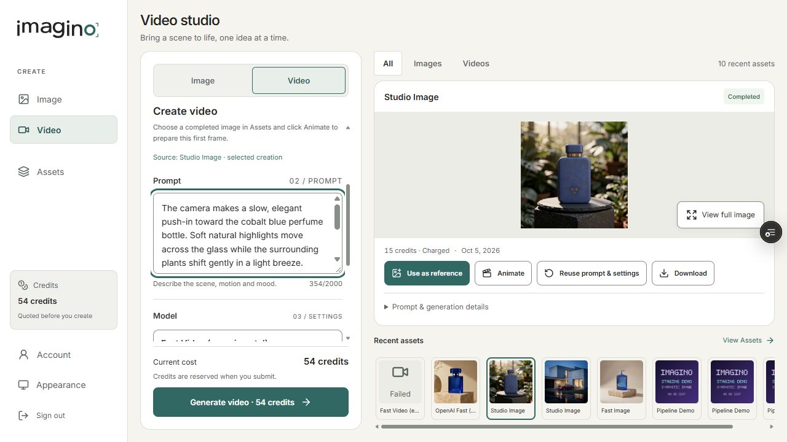
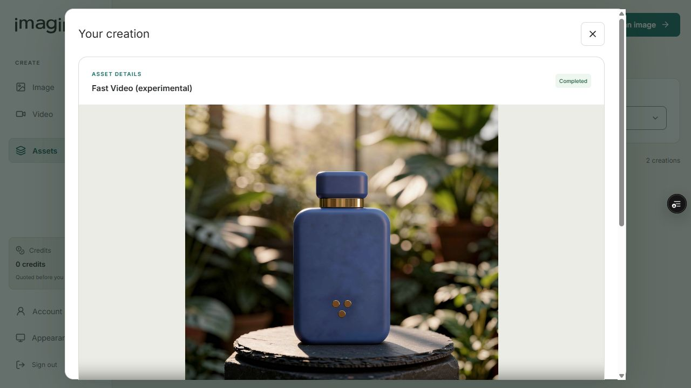
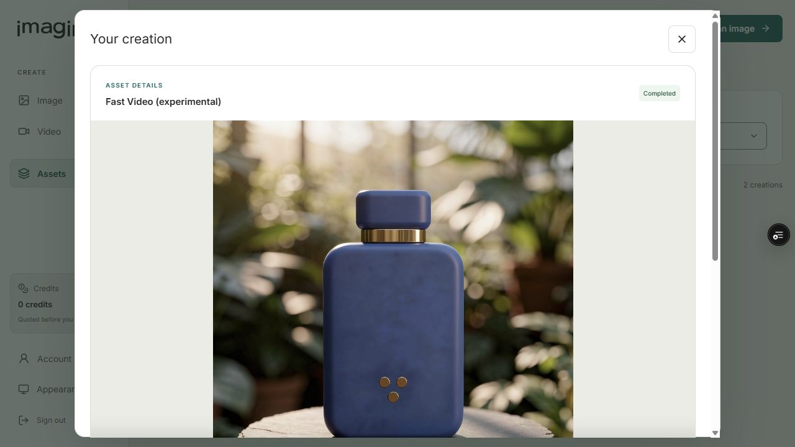
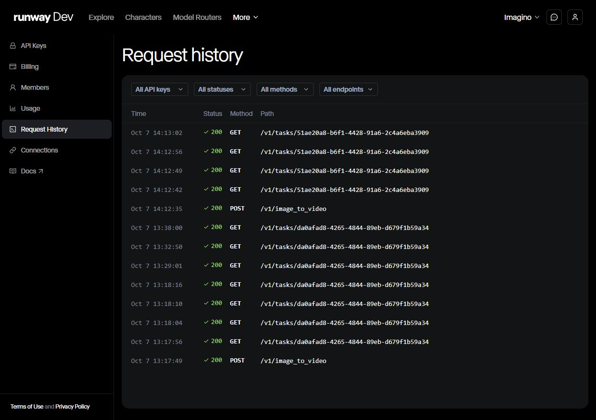
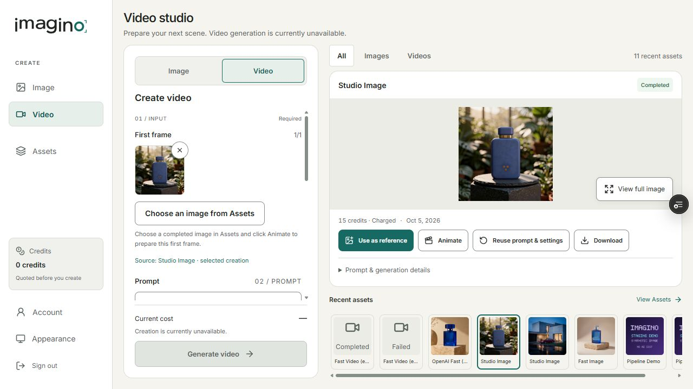
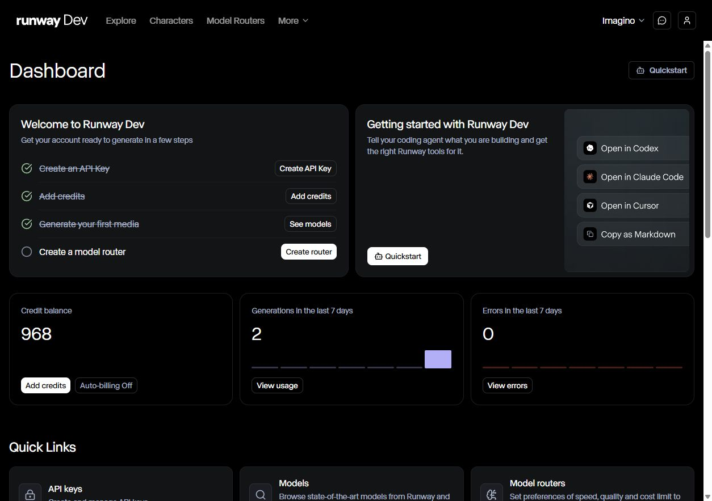

# Imagino Video V1 — confirmação E2E

2026-10-07. **Imagino Video V1 = PASS em staging.** A única nova criação explicitamente autorizada percorreu quote → reserva → job → Runway POST/task/poll → SUCCEEDED → download → validação MP4 → PUT no R2 → Completed/Charged → Assets → playback e download autenticados. O novo ledger terminou consumido e ambas as flags de gasto foram fechadas.

## Entrega dos 15 itens

| Item | Resultado |
| --- | --- |
| 1. Imagino job ID | `6ac67d7f691061807a15e6b8`. |
| 2. Runway task ID | `51ae20a8-b6f1-4428-91a6-2c4a6eba3909`, SUCCEEDED, um binding. |
| 3. Custo | Provider estimado e observado **US$0,16**, abaixo do teto US$0,25. Estimativa total Imagino **US$0,186**. Runway 984 → 968 créditos, auto-billing Off. |
| 4. Credits | Quote/reserva/charge **54**; saldo sintético Imagino **54 → 0**; um settlement, nenhum refund neste job Completed. Margem experimental planejada **65,56%** sobre US$0,54 de valor de referência, com custo estimado US$0,186. Não constitui receita real nem pricing comercial final. |
| 5. Latência | Criação Imagino → settlement **33,709 s**; POST HTTP **1.006,3532 ms**; aceitação → primeiro RUNNING **7,187 s**; RUNNING → SUCCEEDED **19,176 s**; download **2,193 s**; validação **2,703 ms**; storage **412,9541 ms**. Fila/processamento são observações por polling, não tempos internos exatos. |
| 6. MP4 metadata/hash | `video/mp4`, **960×960**, **5,042 s**, **1.616.054 bytes**; SHA-256 `7bb98530885f772fd624cf7dbf002861af05fb3ed996b1e99e68d8456e23e3ea`. Browser decodificou 960×960 e 5,041667 s. |
| 7. R2 | Bucket privado `imagino-videos-staging`; key `generation-v2/6ac038cb05509cea703277eb/6ac67d7f691061807a15e6b8.mp4`; content type `video/mp4`. PUT concluído antes de Completed. GET autenticado devolveu exatamente os bytes/hash validados. Asset usa `/api/generation/jobs/6ac67d7f691061807a15e6b8/download`, sem URL temporária Runway permanente. |
| 8. Completed/Charged | PASS no proof/journal, API job, histórico, Assets e detalhes do asset. OutputStored precede CompletedCharged; ledger Completed, Halted=true, AttemptCount=1, SettlementCount=1. |
| 9. Playback/download | PASS remoto em Assets: blob autenticado, readyState=4, playback ativo em 0,232804 s e 2,299690 s, término em 5,041667 s, sem media error. Download owner=200; botão Download salvou MP4 em Downloads com hash/tamanho idênticos ao R2. |
| 10. Ownership | Owner job/download=200. Foreign job/download/proof=404. Vídeo permanece privado; nenhum link provider assinado exposto como asset. |
| 11. Animate flow | PASS: Image asset → clique Animate → Video Studio prepara um first frame, 5 s/720p, source `6ac4068a985c143f201d8f15`. PNG preparado 1.352.396 bytes e hash exato `1180fb5b6efd81464a799a2e1fc687ab6a044b21cf0b50ea5d11f041bd36195d`. Sem auto-submit; histórico continua 11 jobs. |
| 12. Visual assessment | Identidade preservada: corpo retangular arredondado, tampa azul curta, azul cobalto, faixa dourada e três círculos. Sem deformação grosseira ou texto espúrio observado nos quadros inspecionados. Push-in consistente; movimento/parallax suave do fundo, brisa pouco evidente. Enquadramento final muito fechado, aproximando/cortando detalhes inferiores. Usável para motion de produto curto, com revisão de enquadramento. Avaliação qualitativa de uma amostra. |
| 13. Request-count proof | **1 novo creation POST, 1 novo task, 4 polling GETs somente desse task, 1 settlement, 0 creation retries, 0 outras chamadas pagas novas**. Histórico Runway mostra novo POST às 14:12:35 BRT e GETs às 14:12:42/49/56 e 14:13:02. O projeto totaliza 2 POSTs: 1 histórico + 1 novo; os 7 GETs históricos pertencem ao primeiro task. |
| 14. Flags finais | PaidGenerationEnabled=false; RunwayRealSmokeEnabled=false; health=200; ledger consumido, sem slot reutilizável. Deploy de fechamento `dep-db37rcss728c73bkoc40` live às 17:13:59.925871Z. |
| 15. Grok Lite / Fast Video | Candidato viável para Fast Video experimental em staging: custo de US$0,16, entrega em cerca de 34 s e preservação de produto nesta amostra. A evidência não estabelece benchmark nem qualidade generalizada; o crop final pede controle de enquadramento em uma futura avaliação autorizada. |

## Preflight, código e histórico preservado

Código executado: `1a16c3eb4cf6629f6ad4d52ee00c72ae414e08b4`; backend **376 testes PASS**, build sem erros. O contrato corrigido aceita exatamente 960×960 para este PNG quadrado autorizado e mantém guards de MIME, container, duração, size cap e host. Testes negativos de geometrias diferentes permanecem. Novo ledger e autorização são persistentes e distintos do primeiro smoke; owner, source/hash, prompt, modelo, configuração, preço, expiração e slot são restritos. O código antigo de Start é rejeitado antes de HTTP; proof histórico permanece somente leitura.

Antes da janela: health 200, PaidGenerationEnabled=false, RunwayRealSmokeEnabled=false, credencial configurada, saldo suficiente de 984 créditos, auto-billing Off e preço oficial reconfirmado em [Runway pricing](https://docs.dev.runwayml.com/guides/pricing/): Lite 720p a 3 créditos/s + 1 first frame, US$0,01/crédito, total 16 créditos. Deploy com flags fechadas `dep-db37n8ad0e5s73fdcn30`; abertura `dep-db37of60tbcc73fub37g`.

Novo run: `runway-grok-lite-e2e-confirmation-20261007`, owner sintético `6ac038cb05509cea703277eb`. Config: `grok_imagine_1_5_lite`, image-to-video, duration=5, ratio=auto_720p, um first frame e uma saída. Source PNG 1024×1024 existente, hash validado antes do gasto. Quote remoto de 54 visível antes de um único clique Generate, com marcador local durável criado antes do clique.

Prompt controlado:

> The camera makes a slow, elegant push-in toward the cobalt blue perfume bottle. Soft natural highlights move across the glass while the surrounding plants shift gently in a light breeze. Preserve the bottle shape, blue color, gold band and overall product identity. Premium luxury product commercial, subtle realistic motion, stable composition, no text.

O run anterior `runway-grok-lite-single-video-20261007`, job `6ac670a9cf3be2fa36628c2f` e task `da0afad8-4265-4844-89eb-d679f1b59a34` permanecem **Failed/Refunded**, 1 tentativa/1 settlement, Halted=true. A comparação integral dos campos expostos de ledger e job antes/depois resultou `previousUnchanged=true`; nenhum reset, reuso ou alteração de histórico. O relatório histórico também foi preservado.

## Evidências

`docs/evidence/runway-video-e2e/` contém preflights fechado/aberto, proof/journal final, histórico comparado anterior, estados owner/foreign, metadados/hash de downloads, request history e screenshots. Não contém key, senha, token, URL assinada provider ou payload base64. MP4 local foi entregue separadamente, sem publicar o bucket privado.

PRs backend #56 e frontend #89 permanecem draft/unmerged. Somente staging foi utilizado. Não houve alteração de Stripe, pricing comercial permanente, produção ou chamada a outro modelo/provider. Trabalho encerrado após esta confirmação.
