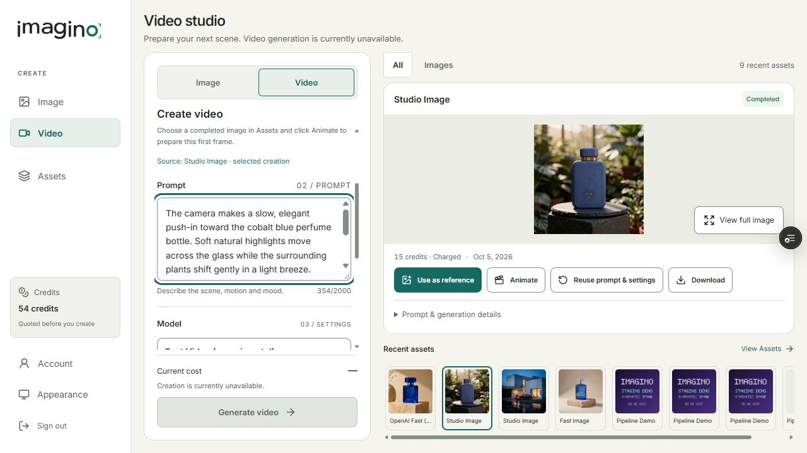
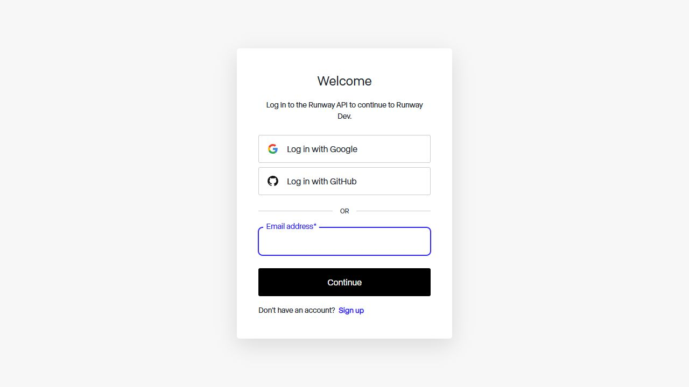

# Imagino Video V1 — Runway single-video staging authorization

Prepared 2026-10-07. Real provider smoke remains pending the user's Runway project, prepaid balance and manually installed key. No provider creation has been authorized by an enabled runtime flag during preparation.

## Verified official contract

Sources checked on 2026-10-07: [API reference](https://docs.dev.runwayml.com/api/), [October changelog](https://docs.dev.runwayml.com/api-details/api_changelog/), [pricing](https://docs.dev.runwayml.com/guides/pricing/), [inputs](https://docs.dev.runwayml.com/assets/inputs/), [outputs](https://docs.dev.runwayml.com/assets/outputs/), [usage tiers](https://docs.dev.runwayml.com/usage/tiers/), [task failures](https://docs.dev.runwayml.com/errors/task-failures/), [setup](https://docs.dev.runwayml.com/guides/setup/).

- Creation: `POST https://api.dev.runwayml.com/v1/image_to_video`.
- Native model: `grok_imagine_1_5_lite`; version header `X-Runway-Version: 2024-11-06`; Bearer authentication.
- Body: `model`, `promptText`, integer `duration`, `ratio`, `promptImage:[{uri,position:"first"}]`. Smoke fixes duration 5 and ratio `auto_720p`, one first frame, one output; no audio/end frame/reference capabilities.
- Official Lite duration supports 1–15 seconds. Input can be an HTTPS URL, data URI or Runway upload URI; this adapter uses a PNG data URI under the official 5 MiB limit and Imagino's stricter 2 MiB limit.
- Creation response: UUID v4 `id`, `estimatedCost.credits`. Estimated cost is never treated as observed cost.
- Poll: `GET https://api.dev.runwayml.com/v1/tasks/{persisted-id}`, at least 5 seconds apart. PENDING/THROTTLED/RUNNING map to Processing; SUCCEEDED requires one output; FAILED/CANCELLED map to canonical failure/cancellation with refund. Terminal `cost.credits` records observed provider cost.
- 429 polling uses Retry-After and bounded backoff. Tier concurrency is project/model dependent and video models share concurrency; no creation retries are enabled. `SAFETY.*` and `INPUT_PREPROCESSING.SAFETY.*` are normalized as moderation failure. Provider moderation refunds vary by failure stage; Imagino failure settlement refunds its reservation once.
- Output URLs expire after approximately 24–48 hours. Only the output hostname documented by Runway, `dnznrvs05pmza.cloudfront.net`, is allowed; redirects/private DNS are rejected. An unexpected hostname fails closed and does not lead to another generation.

## Exact scope and economics

Run ID `runway-grok-lite-single-video-20261007`; catalog model `runway-fast-video-20261007`, version `2026-10-07.1`. Authorization expires at `2026-10-09T00:00:00Z`; one durable slot, owner `6ac038cb05509cea703277eb`, exact service `imagino-api-ai-staging` / `srv-db1tmv17lnhs73efdjp0`, branch `codex/imagino-ai-revival-v2`, AIStaging profile, database `imagino_staging`.

Source: completed/charged BFL Studio Image job `6ac4068a985c143f201d8f15`, blue perfume bottle with gold band and plants, authenticated ownership download. PNG 1024×1024, 1,352,396 bytes, SHA-256 `1180fb5b6efd81464a799a2e1fc687ab6a044b21cf0b50ea5d11f041bd36195d`. The server rereads this asset through the owned storage path and ignores caller-supplied bytes as ownership proof.

Controlled prompt:

> The camera makes a slow, elegant push-in toward the cobalt blue perfume bottle. Soft natural highlights move across the glass while the surrounding plants shift gently in a light breeze. Preserve the bottle shape, blue color, gold band and overall product identity. Premium luxury product commercial, subtle realistic motion, stable composition, no text.

Official provider estimate: `(5 × 3 + 1) × $0.01 = $0.16`, under the $0.25 ceiling. Existing planning formula: `$0.16 × 1.10 + $0.01 = $0.186`; `ceil($0.186 / ((1−0.65) × $0.01)) = 54` experimental Imagino credits. Buffer $0.016, video overhead $0.01, target margin 65%, rounded planning margin 65.56%. Commercial plans/prices and Stripe remain unchanged. Observed cost must come from the task response, not solely a balance delta.

Synthetic owner preparation: 10 existing credits plus a once-only 44-credit grant recorded in `Users.AiStagingCreditGrants` for this run. No commercial credits were purchased. A successful 54-credit charge will leave zero; failure refunds the reservation.

## Durable request and output safeguards

`generation_runway_single_video_v1` holds one document and one slot. Reservation, credit debit and job insertion use one Mongo transaction. Before provider dispatch the ledger transitions Reserved → SubmissionAttempted and increments AttemptCount from 0 to 1. This transition cannot repeat after failure, cancellation, timeout, ambiguity or restart. The task ID and job binding persist atomically; retries of binding persistence reuse the received ID and never call StartAsync again. A unique partial task-ID index prevents a duplicate task binding. Restarted Processing jobs only poll the stored task. A Starting job without a persisted task is never submitted again and is settled submission_unknown after its deadline.

Output requires HTTPS allowlist, `video/mp4`, bounded nonempty bytes (100 MiB maximum), structural MP4 movie/video atoms, approximately 5-second duration and 720p dimensions. Storage uses private `imagino-videos-staging` and deterministic `generation-v2/{owner}/{job}.mp4`. Completed/Charged follows successful R2 PUT. Permanent assets contain the authenticated Imagino download route, never the temporary provider output URL. Failure settlement increments the wallet and ledger settlement count only once within the existing transaction.

The authenticated owner-only proof endpoint `/api/generation/runway/single-video/proof` exposes flags, a credentialsConfigured boolean, ledger counts, task binding, state journal and measured output/latency metadata. It never exposes the key, prompt-image bytes or signed provider URL. Foreign job/download access retains the existing 404 contract.

## Verification before spending

- Backend: 365 tests pass, including 33 Runway cases; build zero errors. Existing BFL authorization tests use a fixed historical date; runtime expiry remains unchanged.
- Frontend: 41 tests pass; optimized Next.js build succeeds.
- Animate browser mocks: two pass; first-frame bytes fetched with authentication, required owned asset, exact 5/720p settings, quote before Generate, zero automatic job submission, foreign asset blocked.
- Existing Studio/Assets/Model Picker/layout browser checks: all 34 pass (33 in the regression run and the updated design-review case on a focused rerun). The design fixture now preserves availability declared by the new catalog and reserves migration status for retiring models.
- Mocks establish adapter and UX behavior; they are not evidence of a real provider response, actual MP4, real transaction concurrency, final real settlement or visual quality.

## Human gate and subsequent single call

Runway documentation requires a minimum manual prepaid purchase of $10 (1,000 credits) if the project has no credits. The signed-out browser exposes email/Google/GitHub login and sign-up. Billing purchase choices, current balance and auto-recharge state cannot be observed without the user logging in; do not infer that auto-recharge is disabled.

The user should log into `https://dev.runway.com`, create/select the staging project, inspect Billing, keep auto-recharge disabled, and add prepaid credits manually only if desired. In API Keys create a dedicated key. Insert it manually only into Render `imagino-api-ai-staging`, Environment variable `GenerationV2__RunwayApiKey`. Do not send the key in chat. Leave `GenerationV2__PaidGenerationEnabled=false` and `GenerationV2__RunwayRealSmokeEnabled=false` until the user confirms project/balance/key readiness.

After that confirmation: reconfirm current official pricing and exact owned input, verify Available ledger/zero attempts and 54-credit balance, temporarily enable only this finite Runway gate, submit exactly one job, poll only its task, validate/store/settle, record ownership and request-count evidence, then close both spending flags on success or failure and verify health 200. If no task ID is received after an ambiguous response, stop; never recreate. No other provider/model is authorized.

## Current delivery status

Adapter/mocks PASS. Real video PENDING HUMAN GATE. Imagino video job/task IDs, observed provider cost, submit/queue/processing/download/R2/total latencies, MP4 duration/dimensions/size/hash, real Working Studio/Assets playback, real owner/foreign checks and final one-settlement proof remain pending the sole real call. Preparation has made zero provider creation POSTs and spent $0.00.

Backend staging deploy `dep-db36dsid0e5s73f9e6d0`, commit `12d53985a71cc3e23b988bffe5a1c78b12d47e54`, live. Authenticated preflight at 2026-10-07T15:38:19Z: health 200, PaidGenerationEnabled=false, RunwayRealSmokeEnabled=false, credentialsConfigured=false; catalog approval_required/54 credits; ledger Available, AttemptCount=0, SettlementCount=0, JobId=null, TaskId=null; synthetic owner balance 54. Foreign source job, source download and proof endpoint each return 404. These source checks do not substitute for ownership testing of the future generated video.

Recommendation: retain Grok Lite as the staging Fast Video candidate until this smoke establishes identity preservation and usable output. Do not decide final quality or start WAN/Gemini/other comparisons from mocks; those require separate future authorization.

## Entrega solicitada — estado no gate humano

| Item | Evidência / estado |
| --- | --- |
| 1. Adapter Runway | PASS em build, mocks e deploy fechado; homologação real pendente |
| 2. Model ID | `grok_imagine_1_5_lite` |
| 3. Endpoint | `POST https://api.dev.runwayml.com/v1/image_to_video` |
| 4. Asset origem | `6ac4068a985c143f201d8f15`; perfume azul do owner sintético; hash e download autenticado verificados |
| 5. Prompt/config | Prompt controlado acima; image-to-video, 5 s, 720p, uma saída, first frame único |
| 6. Imagino job ID de vídeo | Ainda não criado; ledger JobId=null |
| 7. Runway task ID | Ainda não criado; ledger TaskId=null |
| 8. Provider cost | Estimativa oficial US$0.16; custo observado pendente; gasto da preparação US$0.00 |
| 9. Credits experimentais | 54; custo planejado US$0.186; buffer 10%, overhead US$0.01, margem alvo 65%; saldo sintético 54 |
| 10. Latências reais | Submit/queue/processing/download/R2/total pendentes. Timestamps/journal/output metrics implementados; queue/processing serão observações por polling, com granularidade mínima de 5 s |
| 11. Output MP4 | Duração/resolução/tamanho/hash pendentes; nenhum MP4 fabricado como evidência real |
| 12. Working Studio/Assets | Layout e ações existentes passam nos mocks; Preview remoto carregou Assets reais do owner; vídeo em Assets/playback pendentes |
| 13. Image → Animate | Dois mocks PASS e preparação remota do asset autorizado PASS; first frame 1/1, 5 s, 720p e Generate bloqueado. Correção adicional mantém o source selecionado no painel de resultado |
| 14. Ownership | Source owner autenticado PASS; foreign source job/download/proof 404; ownership do futuro vídeo pendente |
| 15. Request count | AttemptCount=0, SettlementCount=0, sem job/task; zero provider creation POSTs. A prova de exatamente uma criação/task/liquidação dependerá da chamada real |
| 16. Bugs encontrados | Testes BFL dependiam da data atual após expiração (fixada data histórica, runtime preservado); design fixture atribuía migration_required a todo vídeo (agora segue lifecycle); Animate preparava source mas selecionava o resultado mais recente (corrigido e coberto com source fora do primeiro item) |
| 17. Flags / health | PaidGenerationEnabled=false; RunwayRealSmokeEnabled=false; health 200; key ausente confirmada por boolean sem leitura do segredo |
| 18. Recomendação | Manter Grok Lite como candidato Fast Video de staging; decisão de qualidade aguarda único smoke. WAN/Gemini/qualquer alternativa exigem autorização futura separada e não serão chamados nesta tarefa |

Gate imposto pelo pedido do usuário, seções 3 e 18: parar quando faltar projeto/créditos/key e aguardar confirmação manual. O navegador Runway está no login, com opções email, Google, GitHub e Sign up. Não foi possível observar escolhas de compra, saldo ou estado de auto-recharge. O mínimo de US$10 vem da documentação oficial; nenhuma compra ou auto-top-up foi feita. A key deve ser inserida manualmente em `GenerationV2__RunwayApiKey` somente no serviço especificado. A autorização temporária expira em 2026-10-09T00:00Z.

Preview final READY: `dpl_5QNSELRZ8qRbJwC3qgjifiP1F9kk`, commit `109c9dbbb8bbde55b93436949c1db961590ab570`. [Video Studio](https://imagino-front-git-feat-imagino-crea-9cdb36-danitest45s-projects.vercel.app/create/video). Verificação remota em 2026-10-07T15:51:22Z: Assets → source correto → Animate → first frame preparado; 1,352,396 bytes e SHA-256 exato `1180fb5b6efd81464a799a2e1fc687ab6a044b21cf0b50ea5d11f041bd36195d`; source selecionado como Studio Image, 5 s/720p, prompt controlado preparado e Generate desabilitado. Nenhum vídeo novo criado. PRs #56 e #89 permanecem draft/unmerged.

