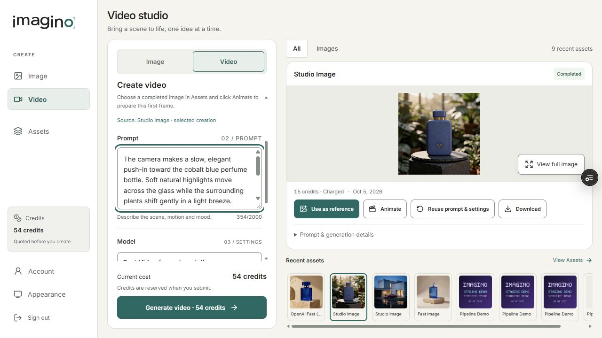
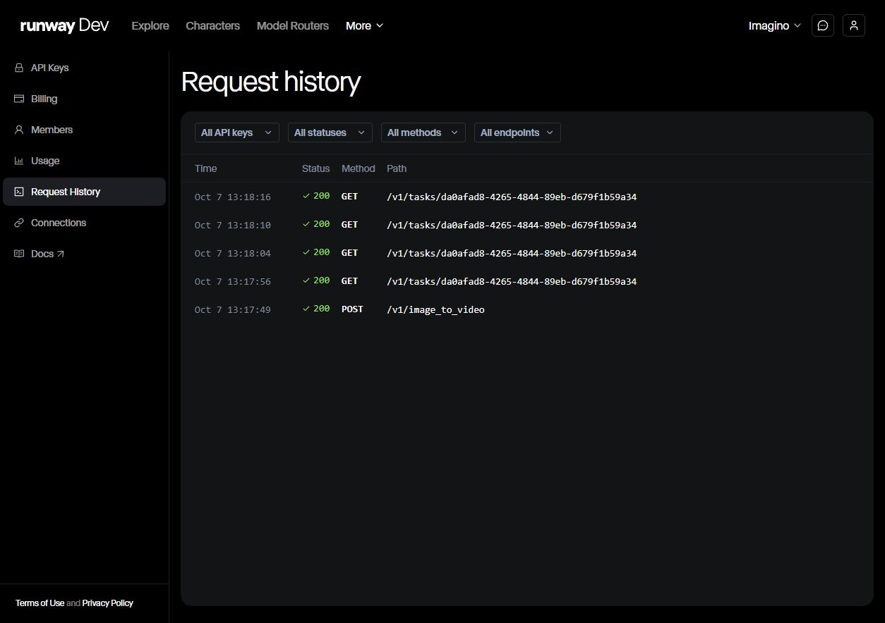
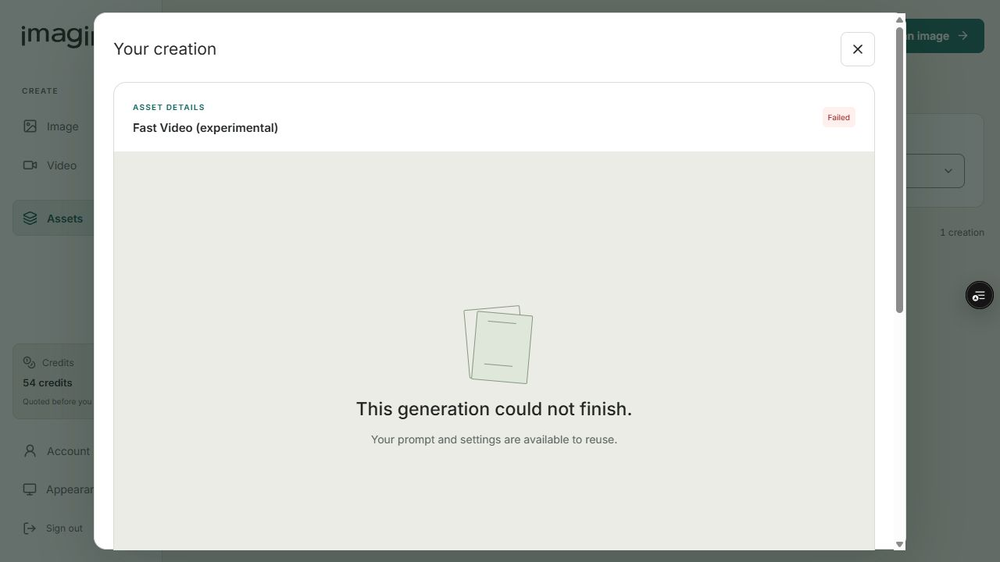
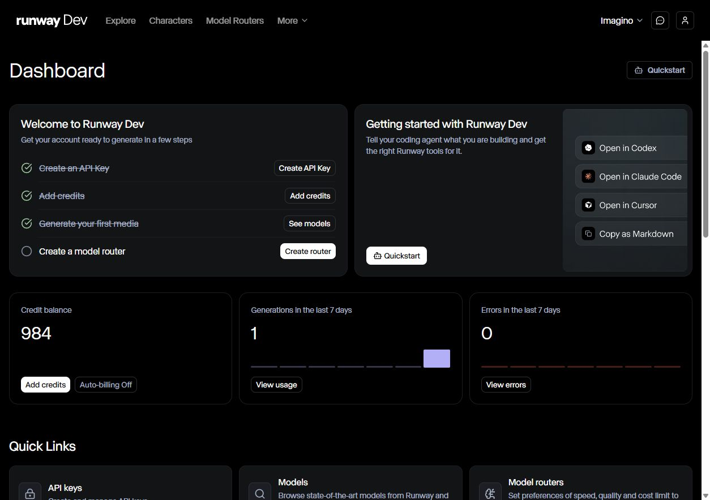

# Imagino Video V1 — resultado da única chamada paga

2026-10-07. **Runway submit/poll/custo: PASS. Fluxo completo Imagino → R2 → Completed/Charged → playback: FAIL.** A Runway gerou o vídeo; o validador do Imagino rejeitou equivocadamente a geometria quadrada antes do R2. O job terminou Failed/Refunded. O slot permanece consumido, com uma tentativa, um task e um settlement. A correção foi testada sem gerar outro vídeo.

## Entrega dos 18 itens

| Item | Resultado e evidência |
| --- | --- |
| 1. Runway adapter | Submit/task/poll/custo PASS real; homologação ponta a ponta FAIL por validação de dimensões. Refund e encerramento PASS. |
| 2. Model ID | `grok_imagine_1_5_lite`; catálogo staging `runway-fast-video-20261007`, versão `2026-10-07.1`. |
| 3. Endpoint | `POST https://api.dev.runwayml.com/v1/image_to_video`; header `X-Runway-Version: 2024-11-06`. |
| 4. Asset origem | `6ac4068a985c143f201d8f15`, perfume azul existente; owner sintético `6ac038cb05509cea703277eb`; PNG 1024×1024, 1.352.396 bytes, SHA-256 `1180fb5b6efd81464a799a2e1fc687ab6a044b21cf0b50ea5d11f041bd36195d`; download autenticado e ownership verificados antes do POST. |
| 5. Prompt/config | Prompt controlado abaixo, image-to-video, `duration=5`, `ratio=auto_720p`, um first frame, uma saída, sem áudio/end frame/references adicionais. |
| 6. Imagino job ID | `6ac670a9cf3be2fa36628c2f`. |
| 7. Runway task ID | `da0afad8-4265-4844-89eb-d679f1b59a34`, persistido antes do polling. |
| 8. Provider cost | Estimado **US$0,16**; observado **US$0,16** no terminal task `cost.credits=16`. Saldo Runway 1.000 → 984 e uma geração no dashboard corroboram o custo. Auto-billing Off. |
| 9. Credits Imagino | Quote **54**; custo planejado US$0,186 = 0,16 × 1,10 + 0,01; buffer 10%, overhead 0,01, margem alvo 65%, margem arredondada planejada 65,56%. Reserva de 54 e refund único de 54; saldo sintético final 54. Não houve receita/Charged neste job: a margem planejada não foi realizada. |
| 10. Latências | Submit HTTP 1.045,1651 ms; fila observada 7.104 ms da aceitação ao primeiro RUNNING; processamento observado 19.291 ms de RUNNING a SUCCEEDED; aceitação → ready 26.395 ms; criação Imagino → refund final 31.695 ms. Fila/processamento são observações por polling de aproximadamente 6–7 s, não tempos internos exatos. Download original não foi instrumentado na falha; R2 não foi executado; sucesso ponta a ponta não foi atingido. |
| 11. Output MP4 | Inspeção somente leitura do mesmo output: `video/mp4`, **5,042 s**, **960×960**, **1.673.733 bytes**; SHA-256 `8168a45788b9d13b1b62a6bcd92172f7ce2dbdcf87d7aae8e11f8359b02fe0f3`. É um output do provider; não é um asset Completed/Charged do Imagino. |
| 12. Working Studio/Assets | Ambas as superfícies mostram Fast Video, Failed e 54 credits · Refunded. Assets filtra o job como video. Playback e download do asset Imagino não existem porque o storage não foi realizado. Nenhum poster externo foi fabricado. |
| 13. Image → Animate | PASS remoto: asset exato preparado como first frame, source selecionado, 5 s/720p, prompt controlado e quote visível de 54 antes do único clique Generate. Animate não submeteu automaticamente. |
| 14. Ownership | Owner job 200; foreign job/download/proof/inspection 404. Owner download do job Failed 404; owner download 200 para vídeo Completed não foi alcançado. Source owner/download já havia passado antes do gasto. |
| 15. Request count | Ledger AttemptCount=1, um TaskId, SettlementCount=1 e Halted=true. Journal: uma autorização de POST, um binding e um FailedRefunded. Histórico Runway: exatamente um POST de criação e quatro GETs de polling no smoke. Três inspeções posteriores fizeram somente GET do mesmo task/output, sem criação; histórico final confirma um POST e sete GETs do mesmo task (4 polling + 3 diagnóstico). Histórico Imagino 9 → 10, com apenas este novo job; nenhuma outra geração/provider. Zero creation retries; nenhum segundo slot. |
| 16. Bugs encontrados | Validador confundia qualidade `auto_720p` com lado mínimo literal de 720 px. Output real quadrado é 960×960. Corrigido para a geometria exata observada do asset autorizado, mantendo duração, container, MIME, host, size cap e shape restritos. Foi acrescentada inspeção do task Failed/Refunded, restrita ao owner, flags fechados, ledger consumido e expiração; não cria, armazena, cobra ou altera settlement. Correções anteriores de seleção Animate e fixtures estão no preflight. |
| 17. Encerramento | PaidGenerationEnabled=false e RunwayRealSmokeEnabled=false comprovados no runtime após deploy; health 200; ledger Failed/Halted, uma tentativa e um settlement; saldo 54. PRs #56/#89 draft/unmerged. Produção, Stripe e preços comerciais preservados. |
| 18. Recomendação | Manter Grok Lite como candidato econômico de Fast Video no staging: custo e execução do provider foram provados. O fluxo de entrega e a qualidade visual ainda não estão homologados. Corrigir a entrega antes de comparar candidatos; nenhuma chamada WAN/Gemini/Seedance/Veo foi feita ou autorizada. Não resetar o ledger nem fabricar Completed/Charged retroativamente. |

## Prompt usado

> The camera makes a slow, elegant push-in toward the cobalt blue perfume bottle. Soft natural highlights move across the glass while the surrounding plants shift gently in a light breeze. Preserve the bottle shape, blue color, gold band and overall product identity. Premium luxury product commercial, subtle realistic motion, stable composition, no text.

## Causa e limites da correção

O payload real pediu a qualidade correta `auto_720p`, custando 16 créditos Runway. A documentação oficial de [inputs](https://docs.dev.runwayml.com/assets/inputs/) define essa qualidade para image-to-video e informa que a proporção acompanha a imagem de entrada. A geometria 960×960 deste task foi medida no MP4 e constitui evidência empírica deste output; não foi inferida da tabela de text-to-video. O preço foi reconfirmado imediatamente antes do POST na [documentação de pricing](https://docs.dev.runwayml.com/guides/pricing/).

A implementação anterior usava `Math.Min(width,height)==720`, uma suposição incorreta. O MP4 real tem container e MIME válidos, duração dentro da tolerância e geometria quadrada. A correção exige 960×960 para este source fixo e continua rejeitando outras dimensões. Testes incluem 720×720, 1280×720, 960×720, 1080×1080 e 1920×1080 rejeitados; os mocks válidos agora usam a geometria real.

O refund já havia sido concluído quando a causa foi identificada. Alterar o job para Charged, debitar novamente ou incrementar outra liquidação contrariaria a prova de um settlement. O job histórico e o ledger foram preservados. Nenhuma segunda geração foi feita para mascarar o resultado.

Não houve inspeção visual do vídeo nem validação de codec/playback em Assets. Metadados de container não demonstram preservação visual do frasco. Portanto a qualidade visual permanece não avaliada.

## Validação e evidências

Antes do gasto: backend 365 testes PASS; frontend 41 testes PASS e build Next.js PASS; 36 checks Chrome de Animate/layout/Studio/Assets/Model Picker PASS. Depois das correções de diagnóstico e geometria: backend **372 testes PASS**, build de teste sem erros. Os testes de inspeção usam repository estrito: somente ledger/Get e HTTP GET são permitidos, sem settlement/storage/creation.

Evidências em `docs/evidence/runway-video/`: preflight, quote antes do clique, proof terminal/runtime fechado, journal, owner/foreign statuses, output-inspection metadata, histórico de requests e screenshots de Studio/Assets e saldo Runway. Nenhum arquivo de evidência contém key, token, senha, bytes de prompt-image ou URL assinada do provider.

A correção foi confirmada no mesmo output por inspeção remota: validation=valid_mp4, hash e tamanho idênticos, 960×960 / 5,042 s; flags false, health 200, ledger 1 tentativa / 1 settlement e saldo 54 preservados. Deploy de código: dep-db37a03bc2fs73crm76g; commit 61489757d52112ceca873d774720bc62bc4177ed. O storage e o job histórico não foram alterados.

